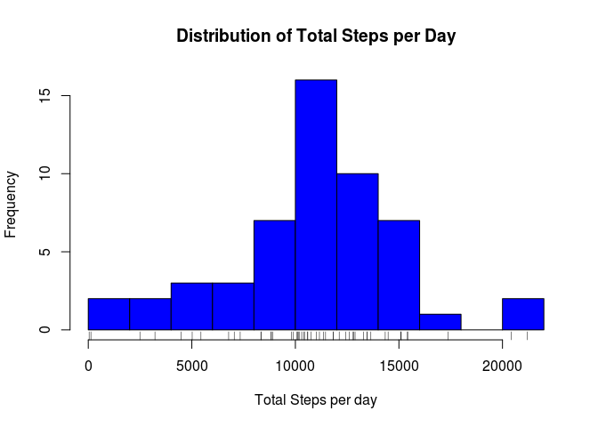

## Loading and preprocessing the data
First we unzip the data. Then we'll load the unziped CSV it into a variable called *data*.  

```r
unzip("activity.zip")
data <- read.csv("activity.csv")
```
  
Then let's look at the data

```r
names(data)
```

```
## [1] "steps"    "date"     "interval"
```

```r
head(data)
```

```
##   steps       date interval
## 1    NA 2012-10-01        0
## 2    NA 2012-10-01        5
## 3    NA 2012-10-01       10
## 4    NA 2012-10-01       15
## 5    NA 2012-10-01       20
## 6    NA 2012-10-01       25
```

```r
str(data)
```

```
## 'data.frame':	17568 obs. of  3 variables:
##  $ steps   : int  NA NA NA NA NA NA NA NA NA NA ...
##  $ date    : Factor w/ 61 levels "2012-10-01","2012-10-02",..: 1 1 1 1 1 1 1 1 1 1 ...
##  $ interval: int  0 5 10 15 20 25 30 35 40 45 ...
```

Notice that the date column comes in as a Factor. Let's change that the type to Date. The format is YYYY-MM-DD.


```r
data$date <- as.Date(data$date)
str(data)
```

```
## 'data.frame':	17568 obs. of  3 variables:
##  $ steps   : int  NA NA NA NA NA NA NA NA NA NA ...
##  $ date    : Date, format: "2012-10-01" "2012-10-01" ...
##  $ interval: int  0 5 10 15 20 25 30 35 40 45 ...
```

Great! We should be ready to go!
  


## What is mean total number of steps taken per day?
Let's first get rid of the missing values in the data set.

```r
dim(data)
```

```
## [1] 17568     3
```

```r
nonmissing <- data[complete.cases(data), ]
dim(nonmissing)
```

```
## [1] 15264     3
```
We can see that the number of rows in the **nonmissing** dataframe is less than in **data**.

Now let's sum up the number of steps in each day. We can do that with the **aggregate()** method. Then create a histogram showing the distribution of the steps walked in each day.

We can add a bit more context by adding a rug to the histogram.


```r
totals <- aggregate(nonmissing$steps, by=list(Date = nonmissing$date), FUN = sum)
hist(totals$x, breaks = 10, col = "blue", xlab = "Total Steps per day", main = "Distribution of Total Steps per Day")
rug(totals$x)
```

<!-- -->


## What is the average daily activity pattern?


## Imputing missing values


## Are there differences in activity patterns between weekdays and weekends?
