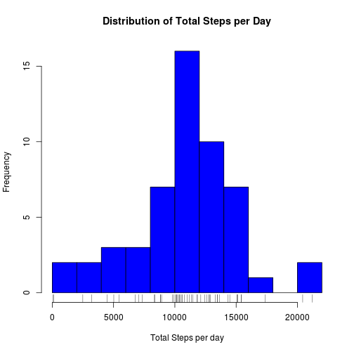
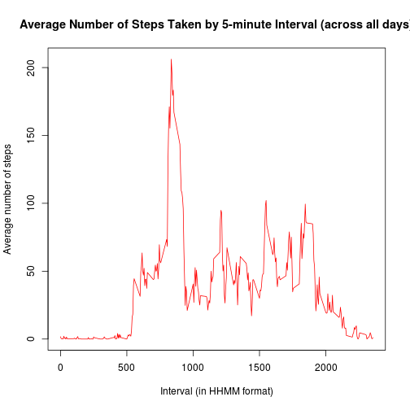
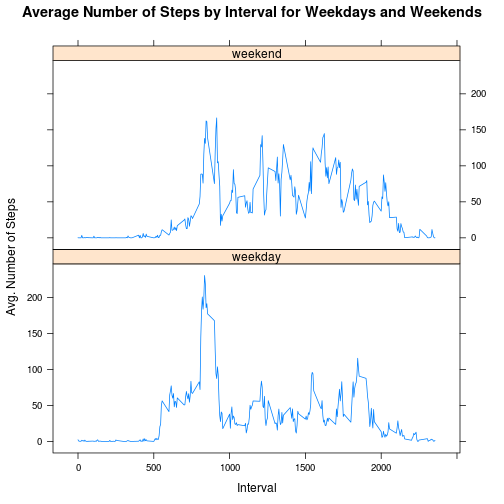

Reproducible Research: Peer Assessment 1
===========================================

## Loading and preprocessing the data
First we unzip the data. Then we'll load the unziped CSV it into a variable called *data*.  

```r
unzip("activity.zip")
data <- read.csv("activity.csv")
```
  
Then let's look at the data

```r
names(data)
```

```
## [1] "steps"    "date"     "interval"
```

```r
head(data)
```

```
##   steps       date interval
## 1    NA 2012-10-01        0
## 2    NA 2012-10-01        5
## 3    NA 2012-10-01       10
## 4    NA 2012-10-01       15
## 5    NA 2012-10-01       20
## 6    NA 2012-10-01       25
```

```r
str(data)
```

```
## 'data.frame':	17568 obs. of  3 variables:
##  $ steps   : int  NA NA NA NA NA NA NA NA NA NA ...
##  $ date    : Factor w/ 61 levels "2012-10-01","2012-10-02",..: 1 1 1 1 1 1 1 1 1 1 ...
##  $ interval: int  0 5 10 15 20 25 30 35 40 45 ...
```

Notice that the date column comes in as a Factor. Let's change that the type to Date. The format is YYYY-MM-DD.


```r
data$date <- as.Date(data$date)
str(data)
```

```
## 'data.frame':	17568 obs. of  3 variables:
##  $ steps   : int  NA NA NA NA NA NA NA NA NA NA ...
##  $ date    : Date, format: "2012-10-01" "2012-10-01" ...
##  $ interval: int  0 5 10 15 20 25 30 35 40 45 ...
```

Great! We should be ready to go!
  


## What is mean total number of steps taken per day?
Let's first get rid of the missing values in the data set.

```r
dim(data)
```

```
## [1] 17568     3
```

```r
nonmissing <- data[complete.cases(data), ]
dim(nonmissing)
```

```
## [1] 15264     3
```
We can see that the number of rows in the **nonmissing** dataframe is less than in **data**.

Now let's sum up the number of steps in each day. We can do that with the **aggregate()** method. Then create a histogram showing the distribution of the steps walked in each day.

We can add a bit more context by adding a rug to the histogram.


```r
totals <- aggregate(list(totalStep = nonmissing$steps), by=list(date = nonmissing$date), FUN = sum)
hist(totals$totalStep, breaks = 10, col = "blue", xlab = "Total Steps per day", main = "Distribution of Total Steps per Day")
rug(totals$totalStep)
```



The **mean** is 10766.1886792453 steps and the **median** is 10765 steps

## What is the average daily activity pattern?
What we need to do here is aggregate over the interval. So first let's look at what the interval looks like.


```r
unique(nonmissing$interval)
```

```
##   [1]    0    5   10   15   20   25   30   35   40   45   50   55  100  105
##  [15]  110  115  120  125  130  135  140  145  150  155  200  205  210  215
##  [29]  220  225  230  235  240  245  250  255  300  305  310  315  320  325
##  [43]  330  335  340  345  350  355  400  405  410  415  420  425  430  435
##  [57]  440  445  450  455  500  505  510  515  520  525  530  535  540  545
##  [71]  550  555  600  605  610  615  620  625  630  635  640  645  650  655
##  [85]  700  705  710  715  720  725  730  735  740  745  750  755  800  805
##  [99]  810  815  820  825  830  835  840  845  850  855  900  905  910  915
## [113]  920  925  930  935  940  945  950  955 1000 1005 1010 1015 1020 1025
## [127] 1030 1035 1040 1045 1050 1055 1100 1105 1110 1115 1120 1125 1130 1135
## [141] 1140 1145 1150 1155 1200 1205 1210 1215 1220 1225 1230 1235 1240 1245
## [155] 1250 1255 1300 1305 1310 1315 1320 1325 1330 1335 1340 1345 1350 1355
## [169] 1400 1405 1410 1415 1420 1425 1430 1435 1440 1445 1450 1455 1500 1505
## [183] 1510 1515 1520 1525 1530 1535 1540 1545 1550 1555 1600 1605 1610 1615
## [197] 1620 1625 1630 1635 1640 1645 1650 1655 1700 1705 1710 1715 1720 1725
## [211] 1730 1735 1740 1745 1750 1755 1800 1805 1810 1815 1820 1825 1830 1835
## [225] 1840 1845 1850 1855 1900 1905 1910 1915 1920 1925 1930 1935 1940 1945
## [239] 1950 1955 2000 2005 2010 2015 2020 2025 2030 2035 2040 2045 2050 2055
## [253] 2100 2105 2110 2115 2120 2125 2130 2135 2140 2145 2150 2155 2200 2205
## [267] 2210 2215 2220 2225 2230 2235 2240 2245 2250 2255 2300 2305 2310 2315
## [281] 2320 2325 2330 2335 2340 2345 2350 2355
```

Note that the values for the interval identify the five minute interval in day. The format is HHMM, that is to say, 2355 corresponds with 23:55 (11:55 PM.)

So now, let's aggreagate over the interval, to get an average number of steps for each five minute interval (over the days in the data set.) and 


```r
totalsByInterval <- aggregate(list(avgSteps = nonmissing$steps), by=list(interval = nonmissing$interval), FUN = mean)
head(totalsByInterval)
```

```
##   interval  avgSteps
## 1        0 1.7169811
## 2        5 0.3396226
## 3       10 0.1320755
## 4       15 0.1509434
## 5       20 0.0754717
## 6       25 2.0943396
```

Now let's plot the time series.

```r
plot(totalsByInterval$avgSteps ~ totalsByInterval$interval, type = "l", col = "red", main = "Average Number of Steps Taken by 5-minute Interval (across all days)", ylab = "Average number of steps", xlab = "Interval (in HHMM format)")
```



Which 5-min interval, on average across all the days in the dataset, contains the maximum number of steps?

```r
maximum <- totalsByInterval[which.max(totalsByInterval$avgSteps), ]
```
The interval with the max number of steps is 835, and the max number of steps is 206.169811320755.

## Imputing missing values
There are many missing values in this data set. Let's take a look at how many observations having missing values.


```r
head(data[is.na(data$steps),])
```

```
##   steps       date interval
## 1    NA 2012-10-01        0
## 2    NA 2012-10-01        5
## 3    NA 2012-10-01       10
## 4    NA 2012-10-01       15
## 5    NA 2012-10-01       20
## 6    NA 2012-10-01       25
```

There are 2304 rows with missing values. For the first part of this analysis we removed the missing values. However, now we want to impute missing values with that completes the data set, but also doesn't change the distribution of the data. One way we can do this is to replace each observation with missing data with the mean of the steps for the corresponding interval. First what we'll do is copy the dataframe


```r
impute <- data.frame(data)
nrow(impute[is.na(impute$steps),])
```

```
## [1] 2304
```

Now we'll complete the missing values in the *impute* dataframe.


```r
library(dplyr)
impute_steps <- function(x) filter(totalsByInterval, interval == x)$avgSteps
impute[is.na(impute$steps),]$steps <- sapply(impute[is.na(impute$steps),]$interval, impute_steps)
missing_rows_imputed <- nrow(impute[is.na(impute$steps),])
```

Note that the number of rows with missing data is now 0.

Now we'll aggregate the imputed data set to report the mean and median number of steps per day.


```r
totals_imputed <- aggregate(list(totalSteps = impute$steps), by=list(date = impute$date), FUN = sum)
mean_imputed <- mean(totals_imputed$totalStep)
median_imputed <- median(totals_imputed$totalStep)
```
The **mean** is 10766.1886792453 steps and the **median** is 10766.1886792453 steps

This is very similar to the totals without the missing values. This is because what we are doing is just replacing a normalized value for the missing values. Furthermore, we are adding the average by interval. In effect, we are not chainging the average of the totals by day.

## Are there differences in activity patterns between weekdays and weekends?
We have a good sense of the activity by date, and by 5-min interval. However, we don't have a good sense of how activity varies from day to day. One might hypothesize that the activity level on a weekend might be more than on a weekday where a subject may be working at relatively sedentary job. In order to get a better sense of the difference between activity on the weekend vs. the weekdays, we need to add a value to our data. We can use the funciton **weekdays()** to help us here.


```r
imputeWithWeekdays <- within(impute, {weekday = ifelse(grepl("S(at|un)", weekdays(impute$date, abbreviate=TRUE)), "weekend", "weekday")})
imputeWithWeekdays$weekday <- as.factor(imputeWithWeekdays$weekday)
head(imputeWithWeekdays)
```

```
##       steps       date interval weekday
## 1 1.7169811 2012-10-01        0 weekday
## 2 0.3396226 2012-10-01        5 weekday
## 3 0.1320755 2012-10-01       10 weekday
## 4 0.1509434 2012-10-01       15 weekday
## 5 0.0754717 2012-10-01       20 weekday
## 6 2.0943396 2012-10-01       25 weekday
```

```r
str(imputeWithWeekdays)
```

```
## 'data.frame':	17568 obs. of  4 variables:
##  $ steps   : num  1.717 0.3396 0.1321 0.1509 0.0755 ...
##  $ date    : Date, format: "2012-10-01" "2012-10-01" ...
##  $ interval: int  0 5 10 15 20 25 30 35 40 45 ...
##  $ weekday : Factor w/ 2 levels "weekday","weekend": 1 1 1 1 1 1 1 1 1 1 ...
```

Now, let's aggregate by the interval, and by the weekday.

```r
aggImputeWithWeekdays <- aggregate(list(avgSteps = imputeWithWeekdays$steps), by=list(interval = imputeWithWeekdays$interval, weekday = imputeWithWeekdays$weekday), FUN=mean)
head(aggImputeWithWeekdays)
```

```
##   interval weekday   avgSteps
## 1        0 weekday 2.25115304
## 2        5 weekday 0.44528302
## 3       10 weekday 0.17316562
## 4       15 weekday 0.19790356
## 5       20 weekday 0.09895178
## 6       25 weekday 1.59035639
```

```r
tail(aggImputeWithWeekdays)
```

```
##     interval weekday    avgSteps
## 571     2330 weekend  1.38797170
## 572     2335 weekend 11.58726415
## 573     2340 weekend  6.28773585
## 574     2345 weekend  1.70518868
## 575     2350 weekend  0.02830189
## 576     2355 weekend  0.13443396
```

And now, let's plot average steps by interval for both weekday and weekend.

```r
library(lattice)
 xyplot(avgSteps ~ interval | factor(weekday), data = aggImputeWithWeekdays, type = "l", xlab = "Interval", ylab = "Avg. Number of Steps", main = "Average Number of Steps by Interval for Weekdays and Weekends", layout = c(1,2))
```


